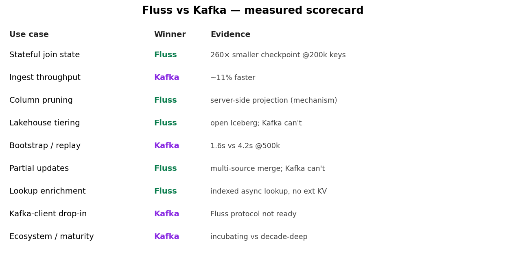

# Benchmark results — is Fluss the Kafka killer?

All measured live on the docker-compose stack (Fluss 0.9.1, Flink 2.2.1, Kafka 3.9
KRaft), single TaskManager. Ratios are the signal; absolute numbers are laptop-scale.

## Scorecard

| # | Scenario | Measured result | Winner | Detail |
|---|----------|-----------------|--------|--------|
| S1 | Delta vs stream-stream join (cardinality sweep) | checkpoint state 3×→**261×** smaller (1k→200k keys) | **Fluss** | [sweep-cardinality.md](sweep-cardinality.md) |
| S2 | Ingest throughput (2M rows @100k rps) | Kafka 98.6k vs Fluss 88.7k rec/s | Kafka (~11%) | [s2-s3-ingest-pruning.md](s2-s3-ingest-pruning.md) |
| S3 | Column pruning | projection pushdown proven (plan); magnitude not isolable | Fluss (qual.) | [s2-s3-ingest-pruning.md](s2-s3-ingest-pruning.md) |
| S4a | Iceberg tiering hot+cold | 500k rows tiered to open Iceberg Parquet, queried | **Fluss** | [s4-iceberg-tiering.md](s4-iceberg-tiering.md) |
| S4b | Bootstrap/replay 500k | Kafka 1.6s vs Fluss-tiered 4.2s | Kafka (latency) | [s4-iceberg-tiering.md](s4-iceberg-tiering.md) |
| S5 | Kafka wire-protocol drop-in | connects but METADATA fails → unusable | Neither (WIP) | [s5-kafka-protocol.md](s5-kafka-protocol.md) |
| S6 | Partial updates | 3 writers, disjoint columns, merged to 1 row | **Fluss** (Kafka can't) | [s6-partial-update-and-joins.md](s6-partial-update-and-joins.md) |
| S7 | Duplicate semantics by sink | append-Kafka 50 / upsert-Kafka 10-logical / Fluss-PK 10 | depends | [s7-duplicate-semantics.md](s7-duplicate-semantics.md) |
| S8 | LEFT join partial+retraction | 9 changelog events for 3 final rows | (cost) | [s8-left-join-retractions.md](s8-left-join-retractions.md) |
| S8b | Lookup join alternative | 3 events, no retraction on late dim | **Fluss** (clean) | [s8b-lookup-join-alternative.md](s8b-lookup-join-alternative.md) |
| S8c | Kafka stream + lookup into Fluss dim | per-event enrichment, no ext KV | **Fluss** | [s8c-kafka-lookup-fluss.md](s8c-kafka-lookup-fluss.md) |
| S9 | Lookup against Kafka vs Fluss | Kafka proctime-lookup rejected; versioned join is stateful | **Fluss** | [s9-lookup-kafka-vs-fluss.md](s9-lookup-kafka-vs-fluss.md) |
| S10 | 100MB-load 3-way state | 87 MB → 48 KB → 12.5 KB | **Fluss** | [s10-100mb-state-comparison.md](s10-100mb-state-comparison.md) |
| S11 | Consistency + sink/duplicate truth | all 3 == same rows; duplicates are a Flink+sink property | — | [s11-consistency-and-sinks.md](s11-consistency-and-sinks.md) |
| S12 | CPU / mem / throughput | state→Fluss, CPU→TabletServer, lookup-bound throughput | — | [s12-cpu-mem-latency.md](s12-cpu-mem-latency.md) |

**Reproduce:** `scripts/run-state-comparison.sh` (CARD=… PAYLOAD=…) for S10/S12,
`scripts/run-consistency-check.sh` (N=…) for S11, `scripts/sweep-delta-join.sh` for S1.

## Charts (post/img/)
- `01_delta_join_cardinality_sweep.png` — the headline: checkpoint state vs key count.
- `02_left_vs_lookup_events.png` — LEFT join (9) vs lookup join (3) events.
- `03_duplicate_semantics_by_sink.png` — dedup by sink type.
- `04_throughput_and_replay.png` — ingest + replay bars.
- `05_scorecard.png` — the verdict table.

## Verdict
**Not a Kafka killer — a complement that wins decisively in its lane.** Fluss wins where
Flink touches state: delta-join state offload (S1, the standout), high-QPS lookup joins
(S8b), partial updates (S6), and open lakehouse tiering (S4a). Kafka still wins raw
ingest (S2), replay latency (S4b), the client ecosystem (S5), and maturity. Pragmatic
architecture: **Kafka as the ingestion bus, Fluss as the Flink-facing state/serving
tier** — land topics into Fluss PK tables, do stateful work there, tier cold to Iceberg.

## Caveats (don't oversell)
- Single laptop node: stream-stream joins destabilized the TM at high cardinality; true
  max-throughput needs a multi-node cluster (not measured).
- S5 Kafka-protocol and the streaming datalake read both hit real incubating-stage bugs.
- Vendor "10× pruning" claim: mechanism proven, magnitude not reproduced at this scale.
