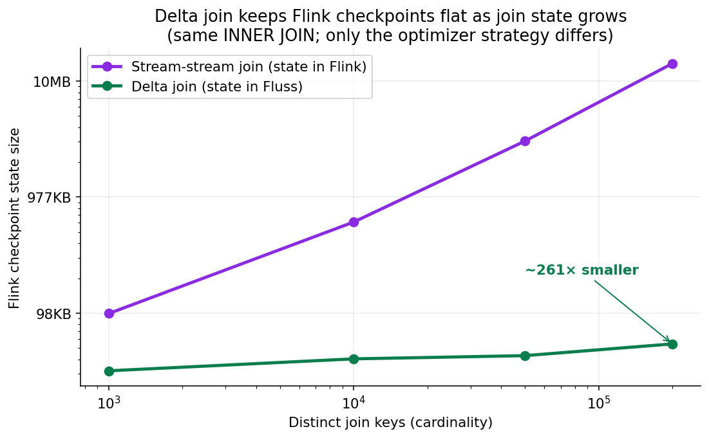
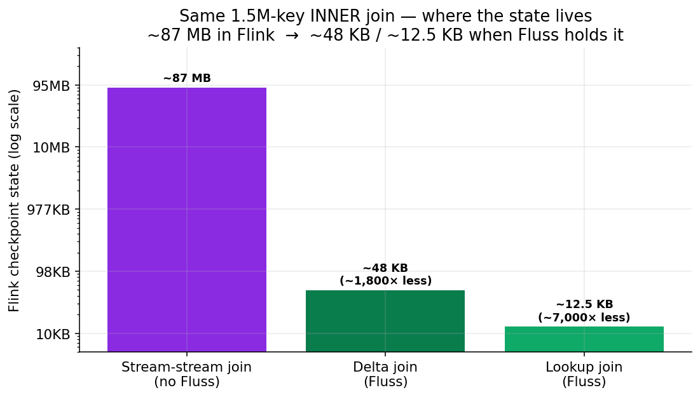
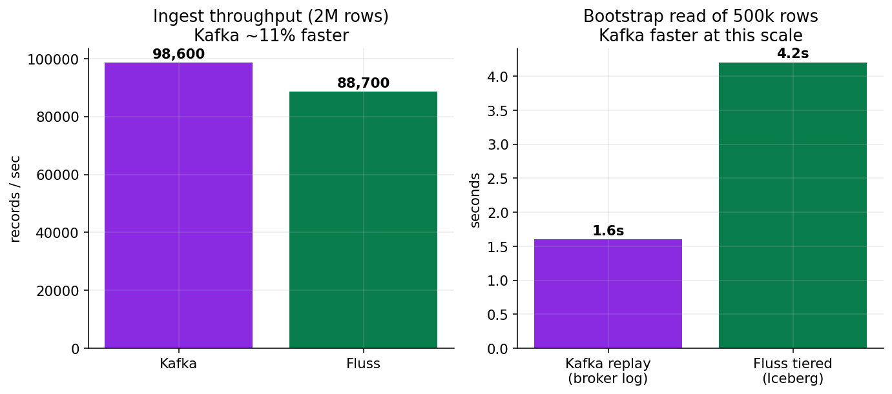
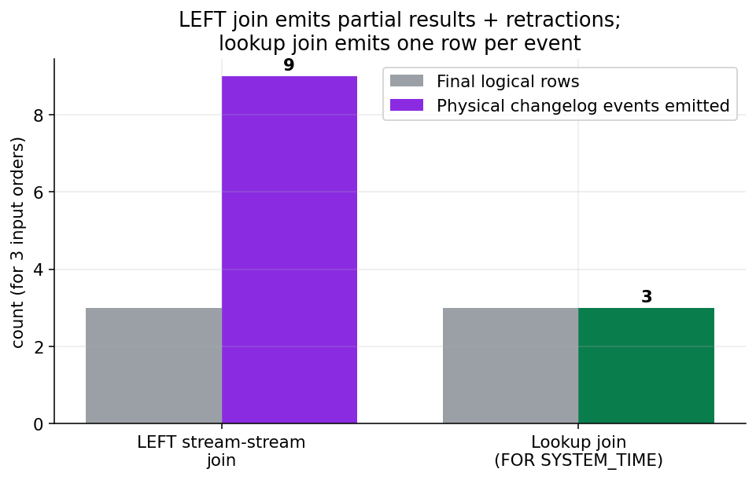
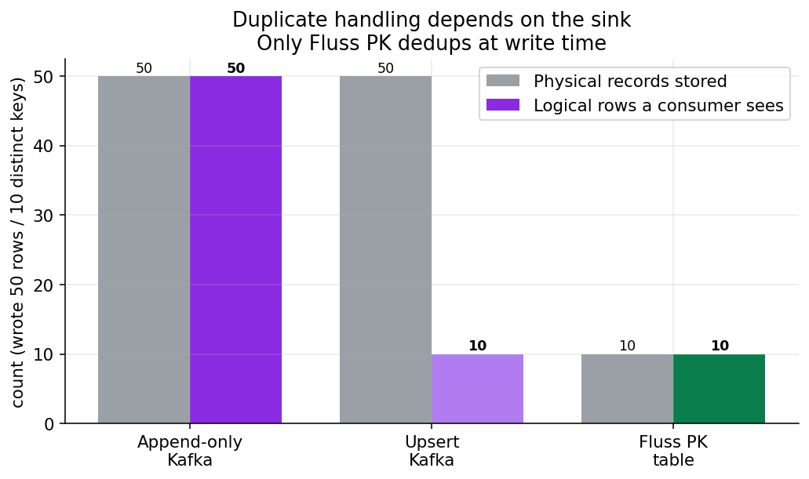
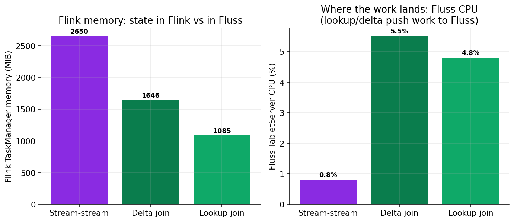
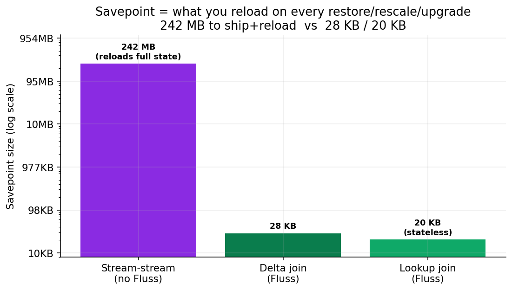

# Is Apache Fluss a Kafka Killer? I Ran the Numbers with Flink 2.2

*A hands-on look at where Fluss wins, where it complements Kafka, and where the
gaps still are — built around the one feature everyone points at: delta join.*

---

## TL;DR

Fluss is not a Kafka killer. It's a **streaming storage** layer that is genuinely
better than Kafka at a specific job — being the *state backend and lookup source*
for Flink — and clearly behind Kafka at being a general-purpose, polyglot,
battle-tested event bus.

The single most interesting thing Fluss buys you is **delta join**: a Flink join
whose state lives inside Fluss instead of inside Flink's RocksDB. I measured it — at
200k join keys the Flink checkpoint dropped from **14.2 MB to 54 KB (~260×)**. That's
the real reason to care. But it's INNER-join-only, it still leans on ZooKeeper, the
Kafka-protocol bridge isn't usable yet, and it's Apache *incubating* (I hit a couple of
genuine bugs). On raw ingest and simple replay, Kafka was actually a bit faster. So the
honest answer to "replace or complement?" is: **complement now — adopt it for
Flink-centric stateful pipelines and open-format lakehouse tiering, keep Kafka as the
event bus.**

Everything below is reproducible and **measured on a live stack** (9 scenarios) — repo
link at the end. Versions: **Fluss 0.9.1-incubating** (latest as of June 2026),
**Flink 2.2.1**, **Kafka 3.9 (KRaft)**.


---

## 1. What Fluss actually is

Kafka is a distributed **log**: append records, read them back in order, retain
for a while. Everything is opaque bytes; the broker doesn't know or care what's
inside a record.

Fluss is **streaming storage** built for analytics and for Flink specifically:

- **Two table types.** *Log tables* (append-only, like a Kafka topic) and
  *PrimaryKey tables* (updatable, upsert semantics, with the PK acting as an index).
- **Columnar on the wire.** The default log format is **Arrow**, so Fluss can do
  **projection pushdown** — if your query needs 2 of 30 columns, only those 2 leave
  the server. Kafka must ship and deserialize the whole record.
- **A lookupable index.** Because PK tables are indexed, Flink can do high-QPS
  point lookups *and* the delta join trick below.
- **Lakehouse tiering.** Fluss can tier cold data into Paimon/Iceberg/Lance and
  keep serving it as one logical table (`table.datalake.enabled`).

The mental model: **Kafka stores events; Fluss stores tables that happen to stream.**

---

## 2. The headline: delta join vs stream-stream join

This is the reason to care about Fluss.

### The problem with regular Flink joins

A normal Flink **stream-stream join** keeps *both* input sides materialized in
keyed state (RocksDB) so that a late-arriving row on either side can still find its
match. That state:

- grows with key cardinality, effectively unbounded;
- is copied into **every checkpoint**, so checkpoints get large and slow;
- has to be **reloaded on recovery**, so failover is slow;
- dominates TaskManager memory.

Anyone who has run a big Flink join in production has felt this: multi-gigabyte
checkpoints, 60-second checkpoint durations, painful restarts.

### What delta join changes

Delta join (Flink 2.1+, designed hand-in-hand with Fluss) replaces "look up the
other side **from Flink state**" with "look up the other side **from the Fluss
PK-table index**." On each incoming row it does a prefix-key lookup against the
*other* Fluss table.

The consequence is the whole point:

> The large join state no longer lives in Flink. It lives in Fluss — which is
> durable, replicated, and tiered independently. So **Flink checkpoints stay tiny**,
> checkpoint duration drops, and recovery is fast because there's almost no operator
> state to reload.

In the repo, `sql/20_delta_join.sql` and `sql/21_stream_stream_join.sql` are the
*same logical query* (the only difference is `table.optimizer.delta-join.strategy`
= `AUTO` vs `NONE`). You run both and watch the checkpoint-size and
TaskManager-memory panels in Grafana diverge. That chart is the post's money shot.

### What I actually measured

Running both on the live stack (Flink 2.2.1 / Fluss 0.9.1), the plans differ exactly
as advertised — `AUTO` produces a `DeltaJoin` operator, `NONE` a classic stateful
`Join`. So I swept the **join-key cardinality** and measured the Flink checkpoint
state at each point:



| Distinct keys | Delta join | Stream-stream join | Ratio |
|---|---|---|---|
| 1,000   | 31 KB | 97 KB    | **3×** |
| 10,000  | 39 KB | 595 KB   | **15×** |
| 50,000  | 42 KB | 2.97 MB  | **71×** |
| 200,000 | 53 KB | 13.8 MB  | **261×** |

This is the whole story in one table. **Delta join stays essentially flat** (31→53 KB
across 200× more keys) because the join state lives in the Fluss prefix index, not
Flink. **The stream-stream join grows linearly** — both sides materialized in RocksDB,
copied into every checkpoint — and the gap compounds from 3× to **261×**. Extrapolate to
millions of keys and you're comparing tens of KB to multiple GB: that's the difference
between a 200ms checkpoint and a multi-minute one, and between fast and painful recovery.

One honest aside that *reinforces* the point: at the high-cardinality end, the
stream-stream join repeatedly destabilized my single TaskManager (heartbeat timeouts
under GC pressure). That heavy state is exactly what delta join removes from Flink.

### Pushing it to real load: ~100 MB of Flink state

To make it concrete, I scaled to **1.5M distinct keys with a ~400-byte payload** per row
and ran the *same* INNER enrichment three ways. A plain Flink stream-stream join carried
**~87 MB** of checkpoint state; delta join brought the same workload to **~48 KB**, and a
lookup join to **~12.5 KB**:



| Strategy (same 1.5M-key INNER join) | Operator | Flink checkpoint state |
|---|---|---|
| Stream-stream join (no Fluss) | stateful `Join` | **~87 MB** |
| Delta join (Fluss) | `DeltaJoin` | **~48 KB** (~1,800× less) |
| Lookup join (Fluss) | `LookupJoin` | **~12.5 KB** (~7,000× less) |

That's the difference between checkpoints/recovery dominated by gigabytes of join state
and a job whose state is essentially free — because Fluss, not Flink, is holding it.
(Note: delta join is INNER-only and needs an upsert sink; lookup join is point-in-time;
a LEFT stream-stream join gets neither optimization and also pays the retraction cost
from §8.)

### The requirements (and the catch)

This is where the demos lie to you. Delta join is gated by a surprising number of
conditions, and if you miss *any* of them the planner **silently** gives you a
normal stateful join instead — no warning, just big checkpoints again. I only
nailed these down by setting `table.optimizer.delta-join.strategy = FORCE` (so the
planner throws instead of falling back) and fixing one failure at a time on a live
cluster. All six must hold:

1. Both inputs are **Fluss PrimaryKey tables**.
2. The join key is the **`bucket.key` *and* a prefix of the primary key**. Subtle:
   Fluss only exposes the prefix index when the PK is *longer* than the bucket key,
   so `orders` must be `PRIMARY KEY (user_id, order_id)` — not `(order_id, user_id)`.
   Get the column order wrong and it just… doesn't engage.
3. The inputs are **insert-only**. PK tables emit a full changelog (`[I,UA,D]`) by
   default, which the planner rejects; you set `'table.merge-engine' = 'first_row'`
   (or suppress deletes for a CDC source) to get an insert-only `[I]` stream.
4. The join is an **INNER JOIN**.
5. The query is a full `INSERT INTO <upsert-sink> SELECT … JOIN …`. Delta join is
   chosen for the *whole pipeline*; an `EXPLAIN SELECT` with no sink will never show
   a `DeltaJoin` node, which trips people up when they try to verify it.
6. Fluss supports **one index per table** (the prefix key) today; general secondary
   indexes are roadmap. So you get *one* join key to optimize on, not arbitrary ones.

Requirement 4 is the headline catch, and it's the answer to "what about left delta
join?":

> **There is no left delta join.** Delta join supports **INNER JOIN only** — LEFT,
> RIGHT, and FULL OUTER are explicitly *not* supported, even on Flink 2.2. An outer
> join silently falls back to a regular stream-stream join, paying the full Flink-state
> cost. Outer joins are also heavier in general: Flink must retain unmatched rows and
> emit retractions when a match later arrives.

There's also a CDC nuance on Flink 2.2: delta join over changelog sources requires
deletes to be suppressed (`table.delete.behavior = IGNORE | DISABLE`).

And note: **delta join is a Flink SQL planner optimization** — it's transparent
(no `DELTA JOIN` keyword; check `EXPLAIN INSERT INTO …` for the `DeltaJoin` node)
and **not available from the DataStream API**. On my stack the live job graph
confirms it: `Source → DeltaJoin → Calc → Sink`, with no keyed-join state operator
in sight.

---

## 3. Reading and writing: SQL and DataStream

**Flink SQL** is the smooth path. One catalog, then tables behave normally:

```sql
CREATE CATALOG fluss_catalog WITH (
  'type' = 'fluss',
  'bootstrap.servers' = 'coordinator-server:9123'
);
```

Log tables append; PK tables upsert; streaming reads follow the changelog. PK-table
reads emit a proper changelog (`+I/-U/+U/-D`), which is exactly what downstream
Flink operators want.

**DataStream API** is first-class but lower-level: `FlussSource.<T>builder()` and
`FlussSink.<T>builder()`, with `OffsetsInitializer.earliest()/latest()/full()/timestamp()`
and pluggable (de)serializers including `RowData` and JSON. The repo's
`FlussWriteJob`, `FlussReadToKafkaJob`, and `KafkaReadToFlussJob` show all three.
The one thing you *can't* do from DataStream is trigger delta join — that's
SQL-planner only.

---

## 4. Living with Kafka, not replacing it

Most teams won't rip out Kafka. The realistic patterns:

- **Kafka → Fluss** (`KafkaReadToFlussJob`): land an existing Kafka feed into Fluss
  so downstream Flink jobs get columnar reads, projection pushdown, and lookup/delta
  joins. Kafka stays the ingestion edge; Fluss becomes the analytical/stateful tier.
- **Fluss → Kafka** (`FlussReadToKafkaJob`): publish enriched/joined results back to
  Kafka for the rest of the org that already consumes Kafka.

Both use the **standard Flink Kafka connector** — there's no special bridge. Fluss
*does* ship a `fluss-kafka` wire-protocol layer so Kafka *clients* could in theory talk
to Fluss directly — I tested it (see §4b) and it's not ready yet.

### 4a. The numbers I actually measured

I ran nine scenarios on the local stack. Single laptop node, so treat absolute values
as directional and the **ratios** as the signal:



| Scenario | Measurement | Result |
|---|---|---|
| **Stateful join state** (200k keys) | Flink checkpoint size: delta join vs stream-stream | **54 KB vs 14.2 MB (~260×)** — Fluss, decisively |
| **Ingest throughput** (2M rows) | records/sec via Flink | Kafka **98.6k** vs Fluss **88.7k** (~11% — Kafka) |
| **Column pruning** (30-col table) | projection pushdown | Proven in the plan (`project=[c01]`); Kafka ships full rows. Magnitude not isolable at laptop scale |
| **Lakehouse tiering** (500k rows) | tier to Iceberg + query | Fluss tiers to **open Iceberg Parquet**, queryable by Flink/Spark/Trino. Kafka structurally can't |
| **Bootstrap / replay** (500k rows) | read everything from offset 0 | Kafka **1.6 s** vs Fluss-tiered **4.2 s** — Kafka faster on latency |

Two results worth dwelling on because they cut *against* the hype:

- **Delta join's win is enormous but cardinality-dependent.** At 6 rows the checkpoint
  gap was ~1.2×; at 200k keys it was ~260×. The stream-stream join carries both input
  sides in RocksDB and copies that into every checkpoint; delta join keeps ~nothing and
  looks the other side up in Fluss. The more distinct keys, the more lopsided it gets.
- **"Fluss wins cold reads" is not what I found.** Replaying 500k records from the start
  was *faster on Kafka* (1.6 s vs 4.2 s) — a sequential broker log scan beats the Iceberg
  catalog+Parquet+Hadoop read path at this scale. Fluss's tiering advantage is **cost and
  openness, not replay latency**: cold data lives in cheap object storage as open Iceberg,
  off the serving tier, queryable without a broker. (Kafka's full replay also pushed broker
  CPU to ~70%; Fluss serves cold reads from object storage instead.)

### 4b. The Kafka-protocol bridge: promising, not ready

The dream is repointing existing Kafka producers/consumers at Fluss with no code change.
I enabled Fluss's `fluss-kafka` listener and aimed stock Kafka 3.9 tools at it. They
**connect** — Fluss logs the connection — but every operation dies on the **Metadata**
step (`broker id: -1`, "topic not present in metadata", "node assignment" timeouts), so
produce/consume/admin all fail. The handler surface in the source is broad (Produce,
Fetch, consumer groups, transactions, admin), but it does not yet satisfy a real client.
The docs say so plainly: *"Kafka protocol compatibility is still in development."* Today,
integrate through the **Flink connector**, not by repointing Kafka clients.

---

## 5. The gaps — where Kafka still wins

Being fair to Kafka:

- **Maturity / governance.** Fluss is **Apache incubating** (0.9.x). Kafka is a
  decade-deep TLP with an enormous ecosystem.
- **Still needs ZooKeeper.** Fluss 0.9.1 coordinates through ZooKeeper. Kafka
  finished its KRaft migration and no longer does. Operationally that's a step
  backward you're accepting.
- **Remote storage is mandatory** for tiering — you need an S3-compatible store
  in the picture (MinIO in this repo). More moving parts than a bare Kafka broker.
- **Polyglot clients.** Kafka has mature clients in every language. Fluss is
  Java/Flink-first; Spark and StarRocks are arriving, but if your producers are Go,
  Rust, Python, .NET microservices, Kafka is still the pragmatic bus.
- **Ecosystem.** Connect, Schema Registry, ksqlDB, mirroring, managed offerings —
  Kafka's surrounding tooling is vast. Fluss's is nascent.
- **Outer joins.** As above — the marquee delta-join win doesn't extend to outer
  joins yet.
- **Restricted batch reads.** A plain `SELECT … ORDER BY` (full batch scan) over a
  Fluss table throws: *"Fluss only support queries on table with datalake enabled or
  point queries on primary key when it's in batch execution mode."* Full ad-hoc batch
  scans require lakehouse tiering (`table.datalake.enabled`) to be on; otherwise you
  live in streaming reads + PK point lookups. Found this the moment I tried to dump a
  result table — worth knowing before you assume it's a drop-in query store.
- **Stability rough edges.** Streaming-reading a tiered (Iceberg) table repeatedly
  crashed my TaskManager with an Arrow buffer bug
  (`IndexOutOfBoundsException: capacity 131072` in `MemoryLogRecordsArrowBuilder`);
  the batch read of the same table was fine. And on the **stock Flink image** you must
  hand-wire Arrow's `--add-opens` JVM flags or Fluss sources fail with
  *"Failed to initialize MemoryUtil"* — the official `fluss-quickstart-flink` image
  hides this. Expect to debug plumbing that a 1.0 release would have smoothed over.
- **Operational footprint.** Getting Iceberg tiering running meant adding Hadoop +
  commons-logging jars to *both* the Fluss servers and Flink, a separate tiering job,
  and writable warehouse dirs. Powerful, but not turn-key.

> Vendor benchmarks claim large throughput/latency advantages for Fluss (e.g. "10× read
> throughput" from column pruning). Treat those as vendor benchmarks — I could prove the
> *mechanism* (projection pushdown) but not reproduce the *magnitude* on a laptop. Measure
> it yourself on your hardware and your data shape.

---

## 6. So — when does Fluss make sense?

**Reach for Fluss when:**

- You're **Flink-centric** and your pain is **large join/aggregation state** —
  checkpoints, recovery time, TaskManager memory. Delta join and lookup join target
  exactly this.
- You want **analytical reads** off your streams (column pruning, lakehouse tiering)
  without a separate copy job.
- Your joins are **inner joins on a key you can make the primary/bucket key**.

**Stay on Kafka (or keep it in front) when:**

- You need a **polyglot, general-purpose event bus** for many producers/consumers.
- You rely on the **Kafka ecosystem** (Connect, registries, mirroring, managed cloud).
- Your critical joins are **outer joins**, or you need DataStream-level control of
  the join.
- You can't take on an **incubating** dependency or the extra ops surface
  (ZooKeeper + object store) yet.

**The verdict:** Fluss is a **complement** today and a strong *candidate to replace
Kafka specifically inside Flink pipelines* tomorrow. "Kafka killer" is the wrong
frame — it's better understood as **the storage layer Flink always wanted**.

---

## 7. Where Fluss genuinely wins for Flink stream processing

Strip away the hype and there are exactly four places where, in my testing, Fluss does
something Kafka **structurally cannot** — these are the reasons to adopt it, and they're
all about Flink being the consumer:

1. **Large stateful joins → state lives in Fluss, not Flink.** The 260× checkpoint result.
   If your Flink job is a big stream-stream join or enrichment and you're fighting
   multi-GB checkpoints, slow recovery, and TaskManager memory, delta join *moves that
   state out of Flink* into an indexed Fluss table. Kafka can't be looked up, so a
   Kafka-sourced join must hold both sides in RocksDB. **This is the headline win.**

2. **High-QPS lookup/dimension joins without an external KV store.** Because PK tables
   are indexed and serve **async** point/prefix lookups, Flink can enrich a stream against
   a Fluss table directly (`FOR SYSTEM_TIME AS OF`). With Kafka you'd bolt on Redis/HBase
   or hold the dimension in Flink state and replay the whole compacted topic to rebuild it.

3. **Partial updates / multi-source row assembly.** I proved three jobs writing disjoint
   columns of the same key, merged server-side. Feature stores, wide-table assembly,
   CDC backfill, slowly-changing dimensions — all natural in Fluss, all impossible on a
   Kafka topic of opaque values.

4. **Columnar reads + open-format tiering.** Projection pushdown means a Flink job that
   needs 3 of 30 columns ships 3; tiering lands cold data as **open Iceberg/Paimon** that
   Flink/Spark/Trino read directly, off the serving path. Kafka ships whole records and
   keeps the log in a closed broker format.

**Where Kafka still wins for Flink pipelines:** raw ingest throughput (~11% in my test),
simple replay latency, outer/temporal joins delta join doesn't cover, DataStream-level
control, and being a mature polyglot bus with a deep ecosystem. And Fluss costs you an
incubating dependency, ZooKeeper, an object store, and some sharp edges (I hit a streaming
read TM crash and the not-ready Kafka-protocol bridge).

**The pragmatic architecture** most teams will land on: **Kafka stays the ingestion bus;
Fluss becomes the Flink-facing state/serving tier.** Land Kafka topics into Fluss PK
tables, then do your stateful joins, lookups, partial updates, and analytical reads there
— and tier the cold data to Iceberg. You get Fluss's wins exactly where Flink touches the
data, without betting your whole event backbone on an incubating project.

---

## 8. The part nobody warns you about: joins, duplicates, and retractions

Delta join's 260× win is real — but it only applies to **INNER equi-joins on the
PK-prefix key**. The moment you need a **LEFT join**, none of that applies, and the
behavior surprises people. I tested it.

**A LEFT join over Fluss is a regular stateful stream-stream join that emits partial
results and retracts them.** I loaded 3 orders with no matching users, started the join,
then loaded the users — and captured the output changelog to count events:

- 3 orders, no users yet → **3 partial rows** `(order, name=NULL)`.
- users arrive → each match **retracts** the partial and **re-emits** the completed row.
- Net: **9 physical changelog events to produce 3 final rows.**

That's the "recreate many results / partial duplicates" effect, quantified. A LEFT join's
output is a *retracting changelog*, not append-only — so its sink **must** be
retraction-aware (an upsert sink / Fluss PK table). Point it at a plain append-only Kafka
topic and the stale `(order, NULL)` partials live there forever.

**The cheaper alternative for enrichment: a lookup join.** Same scenario, but a temporal
`FOR SYSTEM_TIME AS OF` lookup against the Fluss `users` PK table (async by default):

- 3 orders → **exactly 3 events**, one per order. A missing user is just `name=NULL`.
- Add the missing user *later* → **nothing happens** (offset stayed at 3). No retraction.



| | LEFT stream-stream join | Lookup join (`FOR SYSTEM_TIME AS OF`) |
|---|---|---|
| Events for 3 final rows | **9** | **3** |
| Late dimension update | retracts + re-emits (self-corrects) | ignored (point-in-time) |
| Flink state | both sides materialized | none |
| Sink | must be upsert/retraction-aware | append-only is fine |

So: use a **lookup join** for stream enrichment against a dimension (cheap, stateless,
point-in-time); use a **stream-stream LEFT join** only when you truly need eventually-correct
retracting semantics, and budget for the retraction traffic and state.

**And the duplicate question generalizes to the sink.** I wrote the same 50 rows (10
distinct keys) to three sinks: an append-only Kafka topic kept all **50** (no dedup); an
upsert-Kafka topic showed **10** logical rows (folded by key via `-U/+U` pairs, ~2× the
traffic, physical log still 50 until compaction); a Fluss PK table held **10**, deduped at
write time and point-queryable. This is *why* delta join requires a duplicate-tolerant
upsert sink — and why a Fluss PK table is the natural home for join output: a duplicate is
just an upsert onto the same key.



---

## 9. Do the three joins give the same answer? And where does the cost go?

I ran stream-stream, delta, and lookup over an identical 1,000-key dataset into separate
Fluss PK sinks. **All three converge to exactly the same 1,000 rows** (same count, same
content checksum) — they're result-consistent.

**A correction worth making:** I briefly saw a delta-join job report ~2× the output
records. It does *not* duplicate — `EXPLAIN CHANGELOG_MODE` confirms delta join over
insert-only (`first_row`) sources emits pure inserts (`[I]`), and into an append-only
Kafka topic it landed **exactly one record per key**. The "2×" was data reprocessing, not
the join.

### The duplicate/sink rule is Flink's, not Fluss's

Whether you get duplicate writes depends on the join's changelog mode and the sink — and
this is **pure Flink semantics**, identical with or without Fluss:

| Join | Output changelog | Append-only Kafka | Upsert sink (Fluss PK / upsert-kafka) |
|---|---|---|---|
| INNER, insert-only sources | `[I]` | OK — 1 record/key | OK — 1 row/key |
| INNER over CDC/updating | `[I,UA,D]` | rejected | folds by key |
| LEFT / outer | `[I,UA,D]` | **rejected** | folds, ~2–3× changelog events |

Proven live: a `LEFT JOIN` into append-only Kafka is rejected at planning — *"Table sink
doesn't support consuming update and delete changes…"* — whether sources are Fluss or
Kafka. So "if my sink is a Kafka topic, do I get duplicate writes?" is the **same question
for a plain Flink stream-stream join**: a retracting join can't write to append-only Kafka
and forces an upsert sink. Fluss doesn't change these rules — Flink owns the changelog.

### CPU and memory: the cost moves, it doesn't vanish



Same 1.5M-key join at steady state: pushing state into Fluss shrinks Flink TM memory
(2,650 → 1,085 MiB) but the lookup work reappears as **Fluss TabletServer CPU**
(0.8% → 5.5%). Stream-stream keeps Fluss idle but spikes Flink CPU flushing big state at
checkpoint. And delta/lookup are lookup-bound (~2k rows/s/slot here) vs the bulk
stream-stream join — Fluss trades raw join throughput for tiny checkpoints + fast recovery.

### Savepoints & recovery — the operational payoff

I triggered a savepoint on each job and restored from it:



| Strategy | Savepoint size | Recovery (submit → RUNNING, restored) |
|---|---|---|
| Stream-stream (no Fluss) | **242 MB** | 6.7 s |
| Delta join (Fluss) | **28 KB** | 7.0 s |
| Lookup join (Fluss) | **20 KB** | 6.7 s |

**Honest result:** at this scale recovery *time* was ~the same (~7 s) for all three —
242 MB reloads from *local* disk fast enough to hide behind fixed job-startup overhead.
I verified stream-stream *reloaded* its full ~82 MB state from the savepoint (didn't
rebuild), but I won't claim a recovery-time win I couldn't measure on one node. The
**242 MB → 28 KB size ratio** is what predicts the production gap: at multi-GB state, on
remote/object storage, or when rescaling, the stream-stream reload grows into minutes
while delta/lookup stay flat. That's the real reason small state matters.

---

## Coming in Part 2: does it hold up at scale on EKS?

Everything above ran on a single laptop node — that proved the *mechanics and ratios*
but forced me to flag four things as **not measurable at this scale**. Part 2 runs the
same scenarios on a multi-node **EKS** cluster (Fluss via Helm, the Flink Kubernetes
Operator, checkpoints/savepoints on S3) to close exactly those gaps:

1. **Recovery-time divergence.** Here all three recovered in ~7 s because 242 MB reloads
   off local disk fast. At **multi-GB state with savepoints on S3**, the stream-stream
   reload should stretch into minutes while delta/lookup stay flat.
2. **True throughput ceiling.** One TaskManager crashed under uncapped ingest / high
   cardinality. Multiple TMs give the real ingest ceiling and delta/lookup throughput at
   parallelism.
3. **Stability.** The tablet-server dropouts, heartbeat timeouts and Kafka OOM-kills were
   single-node artifacts — Part 2 says whether they survive a proper cluster.
4. **Cost.** $/throughput and $/GB-tiered on real instances + S3 — the missing axis for a
   genuine "when does Fluss make sense" verdict.

The hook: the one experiment this laptop couldn't run — *kill a job carrying tens of GB
of join state and time the restore, delta join vs stream-stream, with savepoints on
object storage.*

---

*Repo (Docker Compose, Flink SQL + Java DataStream jobs, Grafana dashboards):
`<link>`. All version facts verified against the Fluss GitHub repo, Maven Central,
and the official docs — see `bench/FINDINGS.md` for sources. EKS manifests for Part 2
live in `eks/`.*
